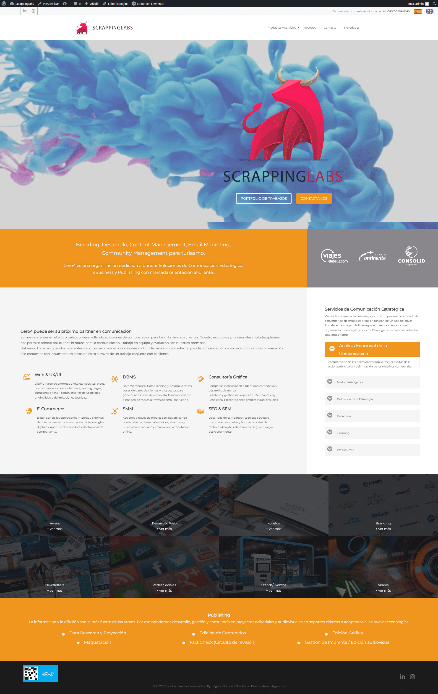

# Landing Scrappinglabs

Landing hecho en WordPress

**DEMO** &#x279c; [https://scrappinglabs-demo.netlify.app/](https://scrappinglabs-demo.netlify.app/)

## Preparar Entorno

- Instalar LAMP (Apache, MySql, PHP) en el entorno del servidor.
  1. En Windows puede instalar [XAMPP](https://www.apachefriends.org/es/index.html)
  2. En Linux puede seguir esta guía: [Instalar LAMP en entorno Linux](https://gist.github.com/EdixonAlberto/0c95d228896c1893cfbcd6d237475aaf)

- Clonar este repositorio en la ruta [C:/xampp/htdocs](C:\xampp\htdocs) (Windows) o [/var/www/html](/var/www/html) (Linux)

- Crear desde apache un virtual host en la ruta `${SERVER_ROOT}/scrappinglabs`

- Modificar el host del servidor para agregar el nuevo dominio `scrappinglabs.com`
```sh
127.0.0.1     scrappinglabs.com
```

- Iniciar `phpMyAdmin` para restaurar la base de datos importando el siguiente archivo [scrappinglabs_db.sql](./docs/scrappinglabs_db.sql)

- Ingresar desde el navegador a la ruta [http://scrappinglabs.com/wp-admin](http://scrappinglabs.com/wp-admin) para iniciar sesión en el CMS con las siguientes credenciales:
```sh
# Usuario:    admin
# Contraseña: tX^xw!Tmkssfz4*uh4
```

## Editar Landing (Desarrollo)

1. Usar Plugin Elementor

- Ir a la sección `Páginas` y seleccionar "Editar con Elementor" para editar el "landing"
- Ir a la sección `Apariencia` y seleccionar "Elementor Header & Footer Builder" para editar el "header" y "footer"

## Visualización


